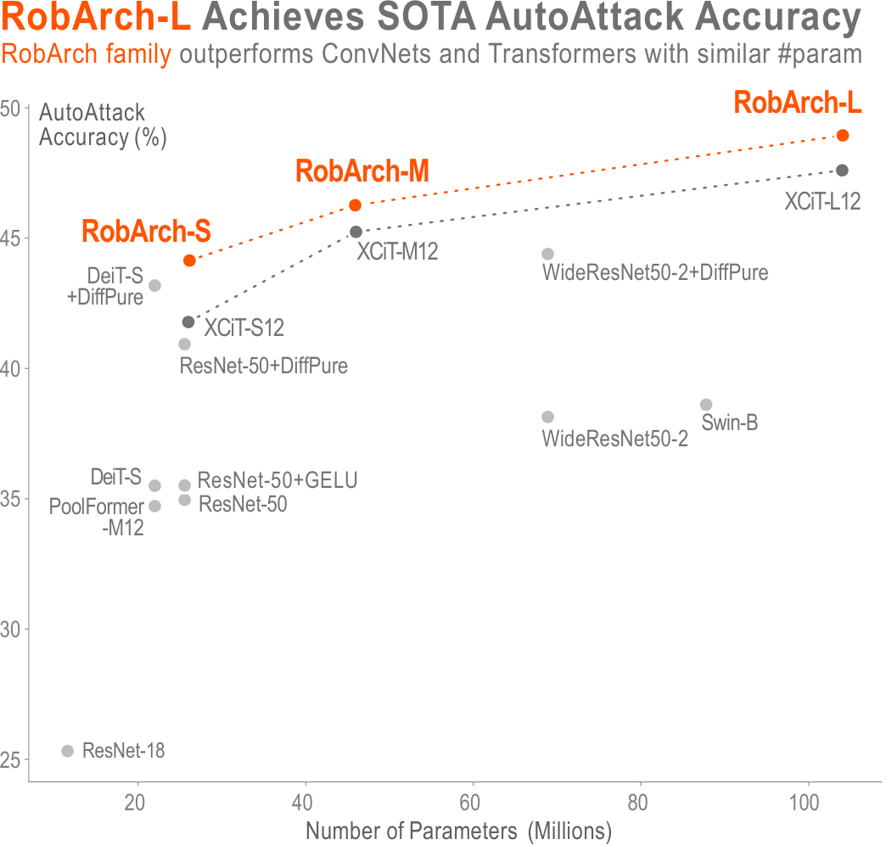

## RobArch: Designing Robust Architectures against Adversarial Attacks
*ShengYun Peng, Weilin Xu, Cory Cornelius, Kevin Li, Rahul Duggal, Duen Horng Chau, Jason Martin*

### Abstract
Adversarial Training is the most effective approach for improving the robustness of Deep Neural Networks (DNNs). However, compared to the large body of research in optimizing the adversarial training process, there are few investigations into how architecture components affect robustness, and they rarely constrain model capacity. Thus, it is unclear where robustness precisely comes from. In this work, we present the first large-scale systematic study on the robustness of DNN architecture components under fixed parameter budgets. Through our investigation, we distill 18 actionable robust network design guidelines that empower model developers to gain deep insights. We demonstrate these guidelines' effectiveness by introducing the novel Robust Architecture (RobArch) model that instantiates the guidelines to build a family of top-performing models across parameter capacities against strong adversarial attacks. RobArch achieves the new state-of-the-art AutoAttack accuracy on the RobustBench ImageNet leaderboard.

<p align="center">
    
</p>

### Prerequisites
1. Register Weights & Biases [account](https://wandb.ai/site)
2. Prepare ImageNet via [Fast AT - Installation step 3 & 4](https://github.com/locuslab/fast_adversarial/tree/master/ImageNet)
> Run step 4 only if you want to use Fast-AT.
3. Set up venv:
```bash
make .venv_done
```

### Training
Fast-AT is much faster than standard PGD AT. For RobArch-S, Fast-AT takes ~1.5 days on 2 Nvidia A100s, but ~5 days on 4 Nvidia A100s.
#### Torchvision models - Fast AT (e.g., ResNet-50)
```bash
make BASE=<imagenet root dir> WANDB_ACCOUNT=<name> experiments/Torch_ResNet50/.done_test_pgd
```
If you want to test other off-the-shelf models in [torchvision](https://pytorch.org/vision/stable/models.html#classification), add the model name in [MODEL.mk](MODEL.mk), and create a new make target by following other ResNets/WideResNets in [Makefile](Makefile).
#### RobArch - Fast AT (e.g., RobArch-S)
```bash
make BASE=<imagenet root dir> WANDB_ACCOUNT=<name> experiments/RobArch_S/.done_test_pgd
```

#### RobArch - Standard PGD AT (e.g., RobArch-S)
```bash
# Training
make BASE=<imagenet root dir> WANDB_ACCOUNT=<name> experiments/PGDAT_RobArch_S/.done_train

# Evaluation on PGD
make BASE=<imagenet root dir> WANDB_ACCOUNT=<name> experiments/PGDAT_RobArch_S/.done_test_pgd

# Evaluation on AutoAttack
make BASE=<imagenet root dir> WANDB_ACCOUNT=<name> experiments/PGDAT_RobArch_S/.done_test_aa

# Pretrained models evaluated on AutoAttack
make BASE=<imagenet root dir> WANDB_ACCOUNT=<name> experiments/PGDAT_RobArch_S/.done_test_pretrained
```


### Pretrained models
- ImageNet $\ell_\infty$-norm

| Architecture | #Param | Natural | AutoAttack | PGD10-4 | PGD50-4 | PGD100-4 | PGD100-2 | PGD100-8 |
| :--: | :--: | :--: | :--: | :--: | :--: | :--: | :--: | :--: |
| [RobArch-S](https://huggingface.co/poloclub/RobArch/resolve/main/pretrained/robarch_s.pt) | 26M | 70.17% | 44.14% | 48.19% | 47.78% | 47.77% | 60.06% | 21.77% |
| [RobArch-M](https://huggingface.co/poloclub/RobArch/resolve/main/pretrained/robarch_m.pt) | 46M | 71.88% | 46.26% | 49.84% | 49.32% | 49.30% | 61.89% | 23.01% |
| [RobArch-L](https://huggingface.co/poloclub/RobArch/resolve/main/pretrained/robarch_l.pt) | 104M | 73.44% | 48.94% | 51.72% | 51.04% | 51.03% | 63.49% | 25.31% |


### Citation

```bibtex
@misc{peng2023robarch,
      title={RobArch: Designing Robust Architectures against Adversarial Attacks}, 
      author={ShengYun Peng and Weilin Xu and Cory Cornelius and Kevin Li and Rahul Duggal and Duen Horng Chau and Jason Martin},
      year={2023},
      eprint={2301.03110},
      archivePrefix={arXiv},
      primaryClass={cs.CV}
}
```